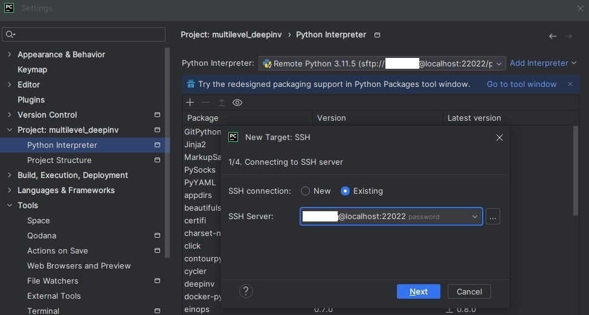

# Development environment

In this document, I give the configuration details of some tools I use to write my python programs and execute them.

# Contents

1. [Creating an SSH tunnel](#Creating-an-SSH-tunnel)
1. [SSH configuration on a code editor](#SSH-configuration-on-a-code-editor)
1. [Run through SSH and disconnect](#Run-through-SSH-and-disconnect)

## Creating an SSH tunnel

To introduce the topic of this section, let us first set the context.
Assuming I have established an SSH connection to a remote machine, then I want to run a program on it
from my editor in the simplest way possible, for example by clicking the run button. Therefore, my editor depends
on my SSH connection.

Since I run code on several machines, I am also performing different SSH connections, but I do not want to change
the setting in my editor each time I use a different remote machine, and therefore I am using an SSH tunnel.
One can think of it this way, the editor will target the entry point of the tunnel which is on the local computer,
and the end point of the tunnel will be the remote machine. Here is the command that makes a tunnel to a machine:

``
ssh -L 22022:machine_address:22 username@proxy_address
``

The option `-L` tells we want to make a tunnel, `22022` identifies the entry point of the tunnel and `machine_address`
address should be the DNS or the IP of the remote machine.

It is important to ensure that the tunnel remains open while you need the SSH connection. For example,
be careful not to close the window/terminal used to run the command (unless you covered this case properly).

To give an example, in the case of the "Centre Blaise Pascal" (CBP), we can end up with
```
ssh -L 22022:gtx680.cbp.ens-lyon.fr:22 username@ssh.ens-lyon.fr
```

See https://www.cbp.ens-lyon.fr/python/forms/CloudCBP for the choice of a machine.

### Authenticating with keys pair

To avoid entering the password each time, you can use a public-key cryptographic system. This can be done with
the following steps.

1. Create a public/private key pair, e.g. using `ssh-keygen -t ed25519 -C "your_email@example.com"`.
   Your **public key**, is located in a file with `.pub` extension (the path is given when after running the command).
   It should look like
   ```
   ssh-ed25519 AAAAC3NzaC1lZDI1NTE5AAAAIB8Ht0Z3j6yDWPBHQtOp/R9rjWvfMYo3MSA/K6q2D81r your_email@example.com
   ```
2. copy the **public key** and add it on a new line at the end of the file `authorized_keys`
on the **remote** file system.
The file `authorized_keys`, if it exists, should have the path `~/.ssh/authorized_keys`.
If it does not exist, create it and give it permissions `700` (you can use `chmod` for that).


## SSH configuration on a code editor

There are three features I am using on my editor to synchronize source code between local and remote machines
and to manage python interpreters I am using. Those are
1. the SSH connection settings
2. python interpreter settings (requires SSH settings)
3. deployment settings (requires SSH settings)

Let us go through each of those points in that order. Firstly, note that all editors may include all those features.
Secondly, I will provide examples of settings which I use in my editor, which is PyCharm.

### The SSH connection settings

Assuming that you have opened the SSH tunnel as explain previously, then the configuration is straight forward.
You should be able to address the following fields:

* Host: `localhost` (since the entry point of the tunnel is on the local machine)
* Port: `22022` (this is the port number we chose when creating the tunnel)
* Username (the one required to authenticate on the remote system)

In PyCharm those can be found in `File > Settings > Tools > SSH Configurations`.


### Python interpreter settings

Add an "on SSH" interpreter
* Tell the editor to use the SSH setting specified above
* Give the path of the interpreter on the remote machine

In PyCharm it can be done with `File > Settings > Project: name > Interpreter`, `add interpreter`,
`On SSH`. The following steps are straight forward, and at some point, the path to the interpreter will be asked.
Additionally, it will also propose synchronize source folders, if you use this, make sure the paths are set correctly.



### Deployment settings

To synchronize source folder between the local and remote machine the system should ask you
* the SSH configuration you want to use
* the local and the remote path you want to map

In PyCharm, it is done automatically after configuring a remote interpreter. You can check the configuration in
`Tools > Deployment > Configuration`. The mapping is visible and can be modified in this same window
in the tab named `Mappings`.


## Run through SSH and disconnect
In this section, we detail one possible way to run a program allowing you to disconnect from the SSH session without
killing process. For example, this allows us to power-off the local computer while having computations running remotely.

Here is the command I use to do that
```
nohup path/to/python3 script_name.py &
```
where `&` puts the process in the background and `nohup` is a UNIX command with description
> nohup - run a command immune to hangups, with output to a non-tty
>
> -- <cite>manual of NOHUP(1)</cite>.

Note that `nohup` creates a file `nohup.out` where `stdout` and `stderr` are redirected.

In order to identify the program, we can save the PID of the process in a file just after running the script
```
nohup path/to/python3 script_name.py &
echo $! > save_pid
```
where the variable `$!` gives the PID of the most recent background process.

If you do not have access to the PID, you can find it in a list using `ps ax`,
where `ax` options lift some restrictions on the process selection.
Since the list is usually too big, we can filter it to find our process
```
ps ax | grep script_name.py
```