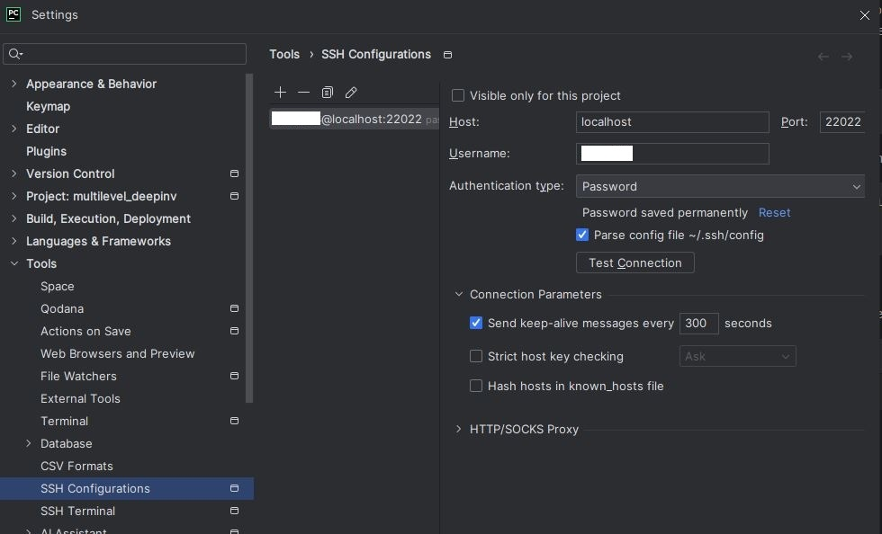
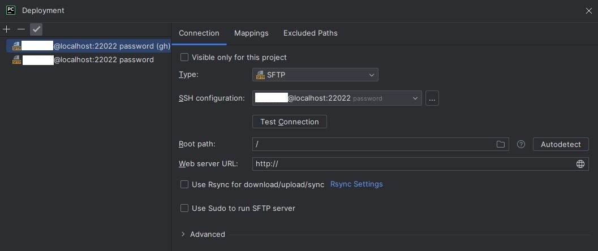

# Python scripts on CBP

In this document, I give the configuration details of some tools I use to write my python programs and execute them.

**Settings for working on CBP**
1. [Connect to CBP : SSH tunnel](#connect-to-cbp--ssh-tunnel)
1. [Install PyCharm editor](#install-pycharm-editor)
1. [SSH configuration on a code editor](#ssh-configuration-on-a-code-editor)
   1. [Use the SSH tunnel](#code-editor-14--use-the-ssh-tunnel)
   1. [Python interpreter](#code-editor-24--python-interpreter)
   1. [Deployment](#code-editor-34--deployment)
   1. [Run script through a configuration](#code-editor-44--run-script-through-a-configuration)

**Additional features you may appreciate**
1. [How to avoid typing your password](#how-to-avoid-typing-your-password)
1. [Run through SSH and disconnect](#Run-through-SSH-and-disconnect)

## Connect to CBP : SSH tunnel

To introduce the topic of this section, let us first set the context.
Assuming I have established an SSH connection to a remote machine, then I want to run a program on it
from my editor in the simplest way possible, for example by clicking the run button. Therefore, my editor depends
on my SSH connection.

Since I run code on several machines, I am also performing different SSH connections, but I do not want to change
the setting in my editor each time I use a different remote machine, and therefore I am using an SSH tunnel.
One can think of it this way, the editor will target the entry point of the tunnel which is on the local computer,
and the end point of the tunnel will be the remote machine.
Here is the command that makes a tunnel to the machine `gtx680` of "Centre Blaise Pascal" (CBP):

```
ssh -L 22022:gtx680.cbp.ens-lyon.fr:22 username@ssh.ens-lyon.fr
```

The option `-L` tells we want to make a tunnel, `22022` identifies the entry point of the tunnel and `machine_address`
address should be the DNS or the IP of the remote machine.

It is important to ensure that the tunnel remains open while you need the SSH connection. For example,
be careful not to close the window/terminal used to run the command (unless you covered this case properly).

See https://www.cbp.ens-lyon.fr/python/forms/CloudCBP for the choice of a machine.

## Install PyCharm editor
If you are interested in using PyCharm, I explain how you can get it from an ENSL account.

PyCharm is available here https://www.jetbrains.com/fr-fr/pycharm/download/other.html. You have
to use the professional version which you can get by providing you ENS email.

Note that I use version 2023.3 for the examples in the sections below.

## SSH configuration on a code editor

There are three features I am using on my editor to synchronize source code between local and remote machines
and to manage python interpreters I am using. Those are
1. the SSH connection settings: *use the SSH tunnel*
2. python interpreter settings (requires SSH settings): *use a python interpreter on CBP*
3. deployment settings (requires SSH settings): *synchronize your source code on CBP automatically*
4. Create a configuration to run a python script

Let us go through each of those points in that order.
However, note that all editors do not necessarily include all those features.

If you use PyCharm you can create a project or open an existing one and follow the examples given thereafter.

### Code editor (1/4) : use the SSH tunnel

Assuming that you have opened the SSH tunnel as explain previously, then the configuration is straight forward.
At some point, your editor will ask you for the fields:

* Host: `localhost` (since the entry point of the tunnel is on the local machine)
* Port: `22022` (this is the port number we chose when creating the tunnel)
* Username (the one required to authenticate on the remote system)

In PyCharm those can be found in `File > Settings...`, `Tools > SSH Configurations`.



### Code editor (2/4) : Python interpreter

Add an "*On SSH*" interpreter
* Tell the editor to use the SSH setting specified above
* Give the path of the interpreter on the remote machine

In PyCharm it can be done with `File > Settings...`, `Project: name > Python Interpreter`, `Add Interpreter > On SSH...`.


The following steps are straight forward, and at some point, the path to the interpreter will be asked.
Additionally, it will also propose synchronize source folders, if you use this, make sure the paths are set correctly.

The section "*Code editor (4/4) : Run script through a configuration*" explains how to use this interpreter.
But first, you may want to configure the deployment as explain below.

### Code editor (3/4) : Deployment

To synchronize source folder between your machine and the CBP, the system requires
* the SSH configuration you want to use
* the local path (where your source code exists) and the remote path on CBP (which you want to synchronize)

In PyCharm, it is done automatically after configuring a remote interpreter. You can check the configuration in
`Tools > Deployment > Configuration...`. The mapping is visible and can be modified in this same window
in the tab named `Mappings`.



### Code editor (4/4) : Run script through a configuration

In PyCharm, on the top bar, next to the run button, click on the dropdown menu. Then, click on
`Edit configurations...`.


Once the new window is opened, click on `+` on the top left, and choose Python.
This will create an `Unnamed` setting that you have to modify:

 * Edit the `Name` as you like.
 * Below `Run`, click on the dropdown menu and select your Python interpreter that is on the CBP.
 * Next to the script dropdown menu, indicate the path to your main script on the local computer.

# Optional features

## How to avoid typing your password

To avoid entering the password each time you create the SSH tunnel,
you can use a public-key/private-key cryptographic system.

The explanations are separated in three parts:
* Create the public-key and private-key using `ssh-keygen`
* Enable the key with `ssh-add`
* Add the public-key to the remote file system

**Part one (local machine)** : create the public-key and the private-key

1.1 On a terminal on the local machine, type `ssh-keygen -t ed25519 -C "your_email@example.com"`.

1.2 It will propose you a path in which to save the public and private key files.
   ```
   Generating public/private ed25519 key pair.
   Enter file in which to save the key (/path/to/.ssh/id_ed25519):
   ```
   If the proposed path suites you, press `enter`, otherwise type the desired path.

1.3 Then, it will ask you for a passphrase to encrypt the private key. You can choose any password you want,
   but remember it since it will be asked later
   ```
   Enter passphrase (empty for no passphrase):
   ```

From now on, the **public-key** refers to the content present in the file `/path/to/.ssh/id_ed25519.pub`, 
where `/path/to/.ssh` is the same directory as the one given in the step `1.2`. 
The **public-key** should look like
```
ssh-ed25519 AAAAC3NzaC1lZDI1NTE5AAAAIB8Ht0Z3j6yDWPBHQtOp/R9rjWvfMYo3MSA/K6q2D81r your_email@example.com
```
In the second part, we will need to copy the public-key, so remember the path to this file or save the public-key.

**Part two (local machine)** : inform your system about the public-key and private-key

2.1 Let the system register the key using
```
ssh-add /path/to/.ssh/id_ed25519
```
where the path `/path/to/.ssh/` is the folder containing the public and private key files.

2.2 It will then ask you for the password you chose at step `1.3`.

2.3 Edit `config` file that is in folder `C:\Users\username\.ssh` on windows.

```
Host w6328
ProxyCommand ssh -W %h:%p username@ssh.ens-lyon.fr
IdentityFile ~/.ssh/id_ed25519
ForwardX11 yes
Compression yes
```

**Part three (CBP)** : add the public-key to the CBP

3.1 If it does not exist, create the file `authorized_keys` using
```
touch ~/.ssh/authorized_keys
```
3.2 Then open this file, e.g. using
```
vi ~/.ssh/authorized_keys
```

3.3 At the end of this file, add your **public-key** on a new line. With vim you can use the following commands
```
shift + g
shift + a
enter
```
then `shift + inser` to paste, alternatively if you don't find `inser` key, you can do `escape` and `"*p`.

To save and exit, you can use
```
escape
:x
```

3.4 Change permissions using
```
chmod 777 ~/.ssh/authorized_keys
```

That's it! You should now be able to connect through SSH without entering your password.

## Run through SSH and disconnect

In this section, we detail one possible way to run a program allowing you to disconnect from the SSH session without
killing process. For example, this allows us to power-off the local computer while having computations running remotely.

Here are two commands I use to do that
```
nohup path/to/python3 script_name.py &
echo $! > save_pid
```
The symbol `&` puts the process in the background and `nohup` is a UNIX command immune to hangups, meaning it will
continue to run when you close the SSH session. The variable `$!` gives the PID of the most recent background process.

The second command `echo $! > save_pid` saves the PID of the `nohup` process in the file `save_pid`. This allows you
to check for its status using `ps -p $(cat save_pid)`.

If you do not have access to the PID, you can find it in a list using `ps ax`,
where `ax` options lift some restrictions on the process selection.
Since the list is usually too big, we can filter it to find our process using
`ps ax | grep script_name.py`.

Also, `nohup` creates a file `nohup.out` where `stdout` and `stderr` are redirected. Therefore,
you can open this file to look for any error message or information about the execution of
your python script.